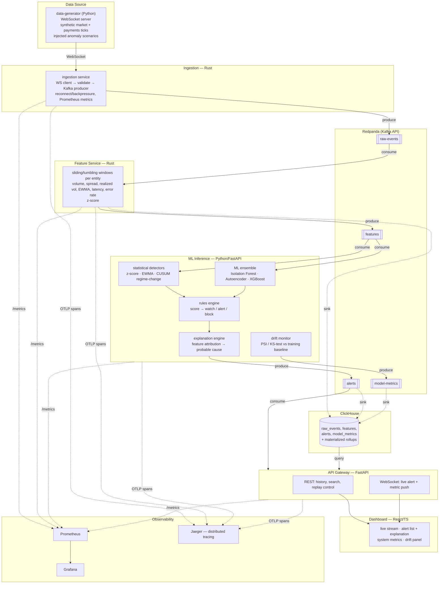

# Architecture

## Goal

Detect anomalous behaviour — abnormal volatility, fraud, operational
incidents, latency spikes, corrupted data — in streaming event data, end to
end, with bounded ingestion→alert latency and measured detection quality
(precision/recall, drift-awareness).

Two synthetic domains are simulated so the same pipeline demonstrably serves
both a quant/market-risk reading and a fintech/fraud reading:

- **market**: synthetic crypto trade ticks
- **payments**: synthetic card/wire/ACH transactions

## System diagram



## Why these choices

| Decision | Rationale |
|---|---|
| **Rust for ingestion + feature service** | These two hops dominate ingestion→alert latency and run at the highest event rate; a GC-free, zero-cost-abstraction language keeps p99 tail latency predictable under load. `tokio` for async I/O, `rdkafka` (librdkafka bindings) for a battle-tested Kafka client. |
| **Redpanda over vanilla Kafka** | Kafka-API compatible so client libraries are unchanged, but single-binary (no ZooKeeper/JVM) — faster local bring-up, lower idle resource cost, closer to what a cost-conscious team would actually run for a project this size. |
| **ClickHouse** | Column store built for exactly this workload: high-cardinality time-series analytics, cheap `GROUP BY window`, fast on both point alert lookups and full-history aggregation for the drift/quality reports. |
| **Python/FastAPI for ML inference** | The ML ecosystem (scikit-learn, PyTorch, XGBoost, SHAP-style attribution) is Python-native; inference happens post-feature-extraction so per-event cost is dominated by model math, not language overhead. Async FastAPI keeps the Kafka consumer loop and metrics endpoint non-blocking. |
| **Feature computation split from ML inference** | Keeps the hot path (parse → window → stat features) in Rust where every microsecond of tail latency is cheap to buy, and keeps the part that actually changes often (model choice, thresholds, explanation logic) in Python where iteration speed matters more than raw throughput. |
| **Statistical + ML ensemble, not just one model** | z-score/EWMA catch simple univariate spikes with zero training data and near-zero latency (useful from minute one, and as a sanity baseline for the ML models); Isolation Forest/Autoencoder catch multivariate/nonlinear anomalies the univariate detectors miss; CUSUM catches slow regime drift that point-anomaly detectors are blind to. Ensembling gives both defense-in-depth and a natural per-detector explanation. |
| **Explicit drift monitor (PSI/KS)** | A model's precision/recall is only as good as the assumption that live data resembles training data. Silently-degrading models are the most common real-world ML-in-production failure; surfacing PSI/KS per feature turns that into a visible, alertable metric instead of a slow, invisible one. |
| **Rules engine as a separate, declarative layer** | Severity thresholds and action mapping (`watch`/`alert`/`block`) change far more often than detection logic, and often need to be owned by risk/compliance rather than engineers. Keeping it a YAML-driven layer instead of inline `if` statements makes that a config change, not a deploy. |
| **JSON on the wire, governed by a real schema registry, not a Confluent wire-format envelope** | Redpanda's schema registry (`scripts/schema_registry.py`) registers every `schemas/*.schema.json` as a subject and enforces BACKWARD compatibility, so a breaking contract change is rejected at registration time — the actual production pattern, not a doc that's easy to forget to update. It's deliberately *not* paired with the Confluent magic-byte wire format: messages stay plain, human-readable JSON (`rpk topic consume` still works without a decoder), because the registry's real value here — reject breaking changes before they ship — doesn't require binary framing at this message size and this team size. See `docs/data-contracts.md`. |
| **One `operator` role, JWT over a shared API key, gated only at the control plane** | The only action in this API with a real-world side effect is `/api/scenarios/inject`; every other endpoint is read-only telemetry, so a viewer/operator split would gate nothing that isn't already public. A shared operator key exchanged for a short-lived signed token is the simplest thing that's still real auth (not a hardcoded header, not security through obscurity) — see `docs/runbook.md`'s "Authentication" section and `docs/roadmap.md` for what a multi-operator/audit-trail version adds next. |
| **Deterministic `alert_id` + `ReplacingMergeTree`, not Kafka transactions, for alert idempotency** | `ml-inference`'s `enable.auto.commit` consumer can reprocess a window across a crash-restart (see `docs/roadmap.md` "Kafka semantics"). Deriving `alert_id` from `(domain, entity_key, window_end)` instead of a random UUID, paired with `risk.alerts` as a `ReplacingMergeTree(ts)` keyed on that tuple, makes a reprocessed window collapse to one stored alert instead of a duplicate — real idempotency for the durable audit trail, at a fraction of the cost of Kafka `exactly_once_v2` transactions, which this project doesn't need since features/alerts aren't billing events. |
| **W3C Trace Context over Kafka headers, OTLP/HTTP to Jaeger, not gRPC** | Every hop (ingestion → feature-service → ml-inference → api-gateway) propagates the *same* trace across two Kafka hops by carrying a `traceparent` message header (see each service's `telemetry.rs`/`telemetry.py`) — Kafka has no built-in trace-context carrier the way HTTP gets for free, so this is manual on both the Rust and Python sides, using each language's standard OTel SDK. OTLP/HTTP over gRPC for the exporter: avoids `tonic`/`protoc` as a new Rust build dependency for a project that already pins carefully to keep builds fast, at no real cost here (a few KB of protobuf per span either way). A `SdkTracerProvider`'s batch exporter runs its HTTP calls on its own dedicated thread outside the Tokio runtime, so the Rust side specifically needs `opentelemetry-otlp`'s `reqwest-blocking-client` feature, not the async default — the async client panics there with "no reactor running" (found by actually running it, not by reading the docs first). |
| **`restart: unless-stopped` on every long-running service, verified with a real chaos test** | `scripts/chaos_test.py` SIGKILLs each core service's process and measures actual recovery time - the restart policy is what makes that recovery possible at all instead of the container staying dead. Building this surfaced a genuine Docker gotcha worth documenting: killing a container from the host (`docker kill`) is treated as a user-intended stop and explicitly does *not* trigger `unless-stopped`'s auto-restart, only killing the process *from inside* the container (simulating an actual crash/OOM) does - the first version of this test killed everything correctly and then measured every target as "never recovered," which is what led to finding this. |

## Latency budget

The headline metric is **ingestion → alert latency**
(`alerts.latency_ingest_to_alert_ms` in the data contract). Target budget for
the local/single-node deployment:

| Hop | Budget |
|---|---|
| WS receive → Kafka produce ack (ingestion) | < 5 ms p99 |
| `raw-events` → windowed feature emit (feature-service) | ≤ `window_size_s` + 20 ms p99 |
| feature consume → ensemble score → alert produce (ml-inference) | < 50 ms p99 |
| **End-to-end (ingest → alert)** | **< window_size_s + 150 ms p99** |

Measured numbers from the load test are published in `docs/metrics.md` and
regenerated by `scripts/load_test.py`.

## Repository layout

```
services/
  data-generator/   Python — synthetic WS data source + anomaly injection
  ingestion/         Rust  — WS → Kafka
  feature-service/    Rust  — Kafka → windowed features → Kafka + ClickHouse
  ml-inference/         Python — detectors, ML ensemble, drift, rules engine
  api-gateway/            Python — REST/WS API for the dashboard
  dashboard/                React/TS — operator UI
infra/                docker-compose services: Redpanda, ClickHouse, Prometheus, Grafana, Jaeger
schemas/               JSON Schema copies of docs/data-contracts.md, used in CI
docs/                  architecture, data contracts, metrics, runbook, roadmap, benchmarks
tests/
  integration/          contract validation against schemas/*.schema.json
  eval/                  precision/recall/F1/drift evaluation harness (unit tested + live)
scripts/                load test, end-to-end demo
```

See `docs/data-contracts.md` for exact event schemas and Kafka topic layout,
`docs/metrics.md` for the full metrics/threshold reference, and
`docs/runbook.md` for operating the local deployment.
