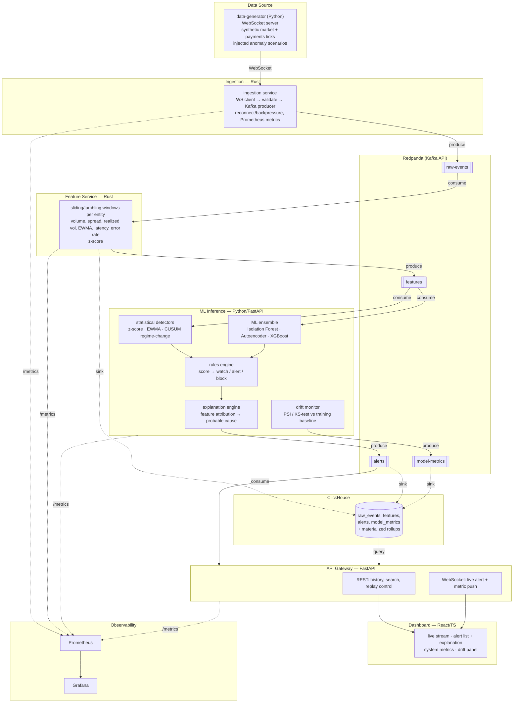

# Architecture

## Goal

Detect anomalous behaviour — abnormal volatility, fraud, operational
incidents, latency spikes, corrupted data — in streaming event data, end to
end, with bounded ingestion→alert latency and measured detection quality
(precision/recall, drift-awareness).

Two synthetic domains are simulated so the same pipeline demonstrably serves
both a quant/market-risk reading and a fintech/fraud reading:

- **market**: synthetic crypto trade ticks
- **payments**: synthetic card/wire/ACH transactions

## System diagram



## Why these choices

| Decision | Rationale |
|---|---|
| **Rust for ingestion + feature service** | These two hops dominate ingestion→alert latency and run at the highest event rate; a GC-free, zero-cost-abstraction language keeps p99 tail latency predictable under load. `tokio` for async I/O, `rdkafka` (librdkafka bindings) for a battle-tested Kafka client. |
| **Redpanda over vanilla Kafka** | Kafka-API compatible so client libraries are unchanged, but single-binary (no ZooKeeper/JVM) — faster local bring-up, lower idle resource cost, closer to what a cost-conscious team would actually run for a project this size. |
| **ClickHouse** | Column store built for exactly this workload: high-cardinality time-series analytics, cheap `GROUP BY window`, fast on both point alert lookups and full-history aggregation for the drift/quality reports. |
| **Python/FastAPI for ML inference** | The ML ecosystem (scikit-learn, PyTorch, XGBoost, SHAP-style attribution) is Python-native; inference happens post-feature-extraction so per-event cost is dominated by model math, not language overhead. Async FastAPI keeps the Kafka consumer loop and metrics endpoint non-blocking. |
| **Feature computation split from ML inference** | Keeps the hot path (parse → window → stat features) in Rust where every microsecond of tail latency is cheap to buy, and keeps the part that actually changes often (model choice, thresholds, explanation logic) in Python where iteration speed matters more than raw throughput. |
| **Statistical + ML ensemble, not just one model** | z-score/EWMA catch simple univariate spikes with zero training data and near-zero latency (useful from minute one, and as a sanity baseline for the ML models); Isolation Forest/Autoencoder catch multivariate/nonlinear anomalies the univariate detectors miss; CUSUM catches slow regime drift that point-anomaly detectors are blind to. Ensembling gives both defense-in-depth and a natural per-detector explanation. |
| **Explicit drift monitor (PSI/KS)** | A model's precision/recall is only as good as the assumption that live data resembles training data. Silently-degrading models are the most common real-world ML-in-production failure; surfacing PSI/KS per feature turns that into a visible, alertable metric instead of a slow, invisible one. |
| **Rules engine as a separate, declarative layer** | Severity thresholds and action mapping (`watch`/`alert`/`block`) change far more often than detection logic, and often need to be owned by risk/compliance rather than engineers. Keeping it a YAML-driven layer instead of inline `if` statements makes that a config change, not a deploy. |
| **JSON event contracts documented in `docs/data-contracts.md`, not a schema registry (yet)** | At this scale, a hand-maintained contract doc + JSON Schema validation in CI gets 90% of the safety of a schema registry (e.g. Confluent Schema Registry / Avro) with a fraction of the operational surface. Noted as the first thing to add if this went to a real multi-team production setting — see `docs/roadmap.md`. |

## Latency budget

The headline metric is **ingestion → alert latency**
(`alerts.latency_ingest_to_alert_ms` in the data contract). Target budget for
the local/single-node deployment:

| Hop | Budget |
|---|---|
| WS receive → Kafka produce ack (ingestion) | < 5 ms p99 |
| `raw-events` → windowed feature emit (feature-service) | ≤ `window_size_s` + 20 ms p99 |
| feature consume → ensemble score → alert produce (ml-inference) | < 50 ms p99 |
| **End-to-end (ingest → alert)** | **< window_size_s + 150 ms p99** |

Measured numbers from the load test are published in `docs/metrics.md` and
regenerated by `scripts/load_test.py`.

## Repository layout

```
services/
  data-generator/   Python — synthetic WS data source + anomaly injection
  ingestion/         Rust  — WS → Kafka
  feature-service/    Rust  — Kafka → windowed features → Kafka + ClickHouse
  ml-inference/         Python — detectors, ML ensemble, drift, rules engine
  api-gateway/            Python — REST/WS API for the dashboard
  dashboard/                React/TS — operator UI
infra/                docker-compose services: Redpanda, ClickHouse, Prometheus, Grafana
schemas/               JSON Schema copies of docs/data-contracts.md, used in CI
docs/                  architecture, data contracts, metrics, runbook, roadmap, benchmarks
tests/
  integration/          contract validation against schemas/*.schema.json
  eval/                  precision/recall/F1/drift evaluation harness (unit tested + live)
scripts/                load test, end-to-end demo
```

See `docs/data-contracts.md` for exact event schemas and Kafka topic layout,
`docs/metrics.md` for the full metrics/threshold reference, and
`docs/runbook.md` for operating the local deployment.
